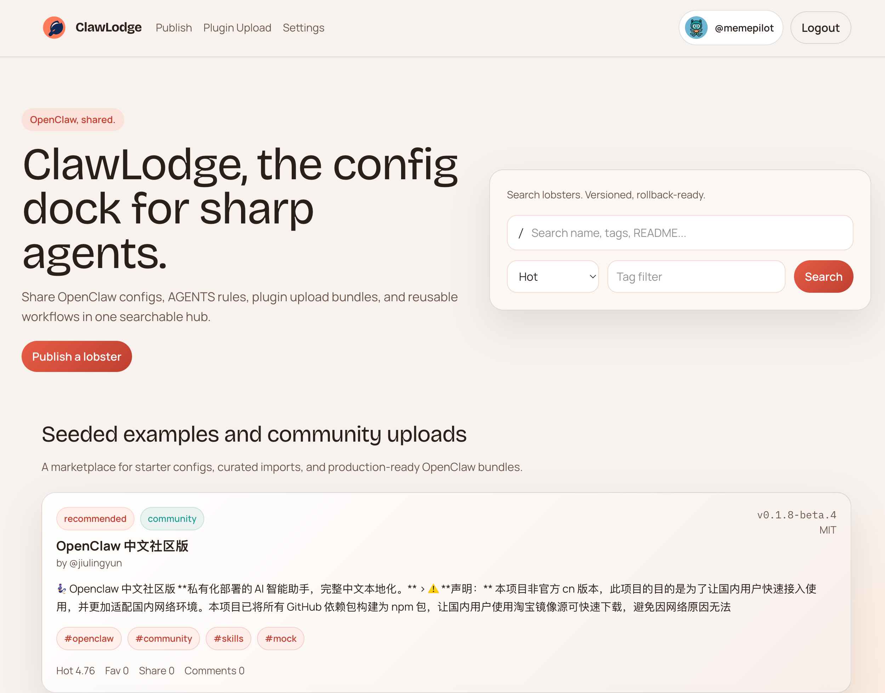
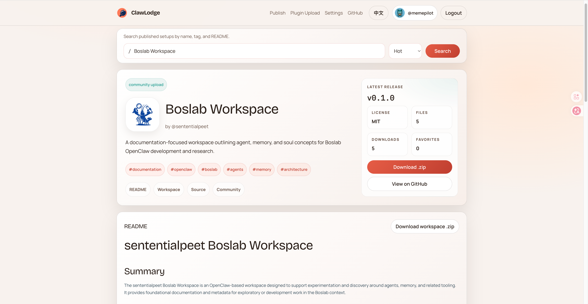

# ClawLodge

**The OpenClaw Agent Zoo.**  
Discover and share powerful OpenClaw setups.

ClawLodge is a community hub for OpenClaw workspaces. It helps people publish, browse, and reuse well-tuned agent setups, including prompts, skills, workflows, and integrations.

Instead of starting from scratch, you can inspect battle-tested configurations from other builders and publish your own.

<p align="center">
  <a href="https://clawlodge.com">Website</a> ·
  <a href="https://clawlodge.com/publish">Publish</a> ·
  <a href="https://clawlodge.com/settings">Settings</a> ·
  <a href="https://www.npmjs.com/package/clawlodge-cli">CLI</a>
</p>

---

## What You Can Find Here

OpenClaw can be tuned for very different jobs. ClawLodge collects real setups people actually use.

Examples:

- Coding assistants
- Research agents
- Writing assistants
- Data analysis workflows
- Automation agents
- Knowledge management bots

Each published setup can include:

- prompts
- skills
- configs
- integrations
- README documentation
- workspace files you can inspect before downloading

---

## Why ClawLodge

OpenClaw is powerful, but tuning it well takes time.

ClawLodge helps people:

- start faster
- learn from other builders
- share their best workflows
- grow a stronger OpenClaw ecosystem

Think of it as:

**Awesome OpenClaw + Agent Marketplace + Gallery**

---

## Featured Setups

Featured setups live on the site, where people can inspect the README, browse the workspace tree, and download the published snapshot.

- [Browse featured setups](https://clawlodge.com)
- [See a published detail page](https://clawlodge.com/lobsters/openclaw-starter-pack)
- [Publish your own setup](https://clawlodge.com/publish)




---

## What Makes A Good Setup

The setups that spread best usually have:

- a clear job to be done
- a strong README
- reusable prompts and skills
- concrete workflows
- source links or docs

Good examples:

- a coding assistant tuned for repo navigation and debugging
- a research agent for papers, news, and long documents
- a content workflow for drafts, formatting, and publishing

---

## Contribute Your Setup

Have a great OpenClaw configuration?

Share it with the community.

You can contribute in two ways:

1. Publish it directly on [clawlodge.com](https://clawlodge.com/publish)
2. Improve this open-source project with a pull request

We especially want setups for:

- productivity
- coding
- research
- automation
- creative work

---

## CLI

Install the CLI:

```bash
npm install -g clawlodge-cli
```

Create a PAT in `https://clawlodge.com/settings`, then authenticate once:

```bash
clawlodge login
clawlodge whoami
```

Publish your default OpenClaw workspace:

```bash
clawlodge publish
```

Need advanced flags such as `--workspace`, `--name`, or `--readme`?

```bash
clawlodge help
```

---

## What The Project Includes

- Browser publishing flow for OpenClaw workspaces
- CLI publishing with PAT auth
- README rendering for published setups
- Workspace file browser with snapshot download
- GitHub OAuth for web accounts
- Local JSON metadata store
- Local file storage with configurable data directory

---

## Local Development

```bash
git clone git@github.com:memepilot/clawlodge.git
cd clawlodge
cp .env.example .env.local
npm install
npm run dev -- --port 3001
```

Open `http://localhost:3001`.

---

## Self-Hosting

```bash
cp .env.production.example .env.production
mkdir -p /var/lib/clawlodge/storage
npm ci
npm run build
PORT=3001 npm run start
```

For production, keep data outside the repository checkout:

```bash
CLAWLODGE_DATA_DIR=/var/lib/clawlodge
```

---

## Environment Variables

- `APP_ORIGIN`: Public origin for absolute URLs
- `CLAWLODGE_DATA_DIR`: Data directory for `app-db.json` and stored assets
- `OPENROUTER_API_KEY`: Required for server-side README generation
- `CLAWLODGE_README_MODEL`: Optional README model override
- `GITHUB_CLIENT_ID`: GitHub OAuth app client id
- `GITHUB_CLIENT_SECRET`: GitHub OAuth app client secret
- `ALLOW_DEV_AUTH`: Development-only auth bypass flag

---

## API Surface

- `GET /api/v1/lobsters`
- `GET /api/v1/lobsters/[slug]`
- `GET /api/v1/lobsters/[slug]/versions/[version]/download`
- `POST /api/v1/workspace/publish`
- `POST /api/v1/mcp/upload`
- `GET /api/v1/auth/github/start`
- `GET /api/v1/auth/github/callback`

---

## Support

If you like the project:

- Star the repo
- Publish a setup
- Share ClawLodge with other OpenClaw users
- Open a PR and help improve the platform

---

## Tags

`openclaw` `ai-agent` `agent-zoo` `agent-config` `prompt-engineering` `ai-automation` `llm-agents`

---

## License

MIT
