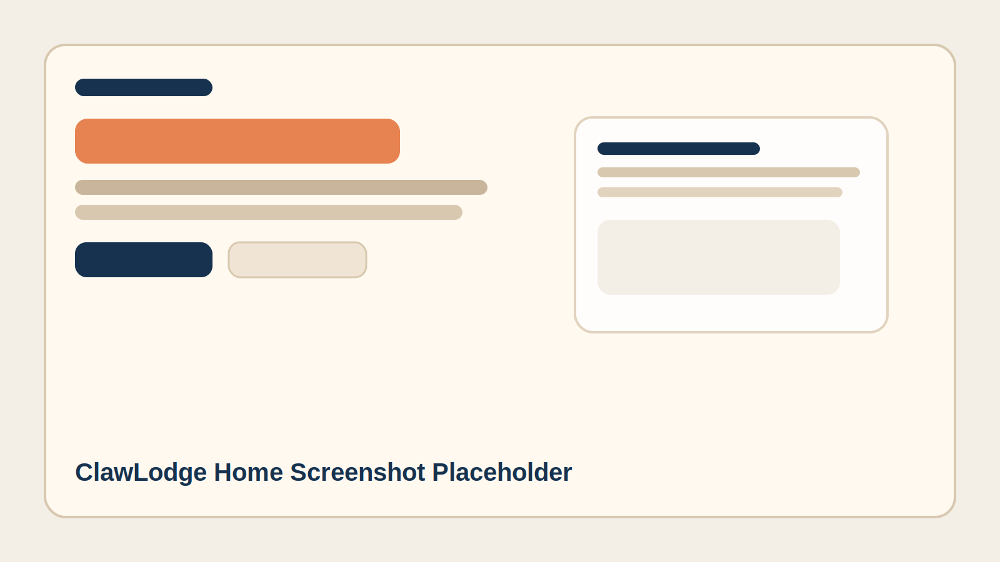
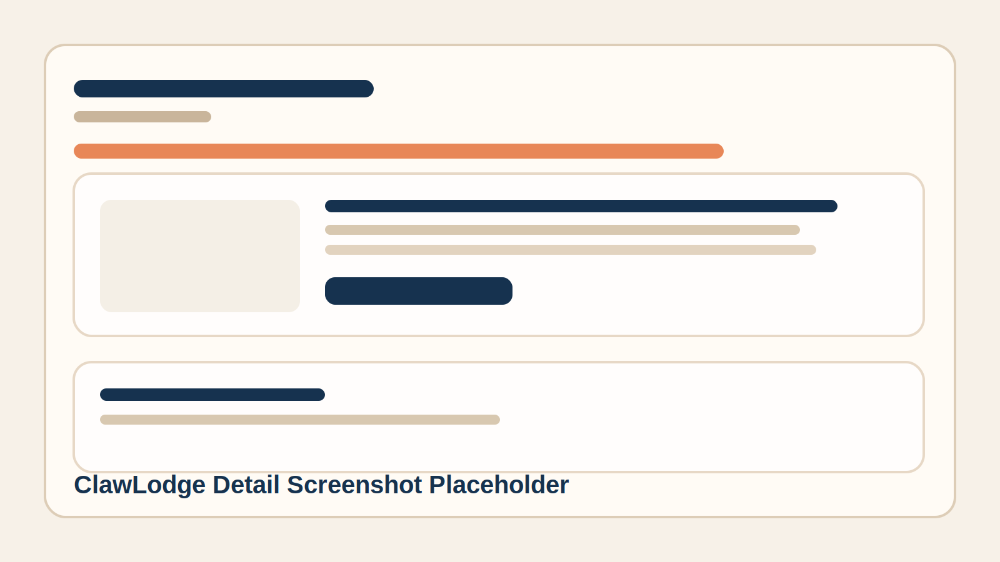

# ClawLodge

**OpenClaw workspace publishing and discovery, in one place.**

ClawLodge is a share hub for OpenClaw workspaces. It lets people publish configs, browse reusable setups, inspect workspace files, download versioned archives, and install the CLI for local publishing.

<p align="center">
  <a href="https://clawlodge.com">Website</a> ·
  <a href="https://clawlodge.com/publish">Publish</a> ·
  <a href="https://clawlodge.com/settings">Settings</a>
</p>

---

## Screenshot

<!-- Replace these placeholders with real screenshots when available. -->




If screenshots are not ready yet, create the files above or replace them with hosted image URLs later.

## Features

- Publish an OpenClaw workspace from the browser or the CLI
- Version each workspace release and download it as a `.zip`
- Show README content, workspace files, source repository links, and publish metadata
- Store uploaded assets locally without exposing server filesystem paths
- Support PAT-based CLI auth with `login`, `whoami`, and `logout`
- Auto-generate README content server-side when the client does not provide one
- Mirror GitHub README images into local storage so published pages do not lose context
- Rank featured workspaces with an internal recommendation score

## Quick Start

### Local development

```bash
git clone git@github.com:memepilot/clawlodge.git
cd clawlodge
cp .env.example .env.local
npm install
npm run dev -- --port 3001
```

Open `http://localhost:3001`.

### Production build

```bash
cp .env.production.example .env.production
mkdir -p /var/lib/clawlodge/storage
npm ci
npm run build
PORT=3001 npm run start
```

## CLI

Install the published CLI:

```bash
npm install -g clawlodge-cli
```

Authenticate once after creating a PAT in `https://clawlodge.com/settings`:

```bash
clawlodge login
clawlodge whoami
clawlodge publish
```

Useful flags:

```bash
clawlodge publish --name "My Workspace"
clawlodge publish --readme /path/to/README.md
```

If `--readme` is omitted, the server can generate README content during publish.

## Environment Variables

- `APP_ORIGIN`: Public origin for absolute URLs. Example: `https://clawlodge.com`
- `CLAWLODGE_DATA_DIR`: Data directory for `app-db.json` and stored assets
- `OPENROUTER_API_KEY`: Required for server-side README generation
- `CLAWLODGE_README_MODEL`: Optional override for the README model. Default: `openai/gpt-4.1`
- `GITHUB_CLIENT_ID`: GitHub OAuth app client id
- `GITHUB_CLIENT_SECRET`: GitHub OAuth app client secret
- `ALLOW_DEV_AUTH`: Development-only auth bypass flag. Keep `false` in production

## Architecture

- Next.js App Router for both UI and API
- Route handlers under `app/api/v1`
- Local JSON database at `CLAWLODGE_DATA_DIR/app-db.json`
- Local object storage at `CLAWLODGE_DATA_DIR/storage`
- PAT-based auth for CLI publishing

## API Surface

- `GET /api/v1/lobsters`
- `GET /api/v1/lobsters/[slug]`
- `GET /api/v1/lobsters/[slug]/versions/[version]/download`
- `POST /api/v1/workspace/publish`
- `POST /api/v1/mcp/upload`
- `GET /api/v1/auth/github/start`
- `GET /api/v1/auth/github/callback`

## Self-Hosting Notes

ClawLodge does not ship a one-click VPS installer.

The intended open-source flow is:

1. Clone the repository.
2. Create `.env.local` or `.env.production`.
3. Run `npm ci`.
4. Run `npm run build`.
5. Start the app behind your preferred process manager or reverse proxy.

For production, keep data outside the repository checkout by setting:

```bash
CLAWLODGE_DATA_DIR=/var/lib/clawlodge
```

## License

MIT
